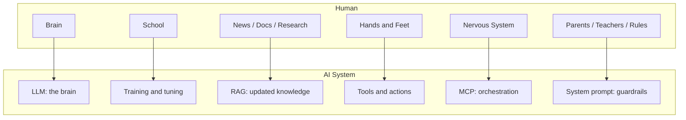

# Modern AI Made Simple

> AI is everywhere, but the terminology can feel overwhelming. This Wiki simplifies modern AI using **six essential concepts** and one easy human analogy.

---

## Why this Wiki exists

Modern AI introduces a lot of terms:

- Artificial intelligence
- Machine learning
- Large language models
- Generative AI
- Retrieval-Augmented Generation
- AI agents
- Model Context Protocol
- System prompts
- Prompt injection

This Wiki turns those terms into one simple mental model:

> **An AI system is like a person made of software.**

It has a brain, it learns, it reads current information, it acts using tools, it coordinates through a nervous system, and it follows rules.

---

## The main human analogy

| Human idea | AI idea | What it does |
|---|---|---|
| Brain | Large Language Model, or LLM | Provides the core reasoning and generation ability |
| School | Model training and tuning | Teaches the model language, patterns, and behavior |
| News, books, documentation | RAG | Gives the model access to current or specific external knowledge |
| Hands and feet | Tools and actions | Lets the model do things in the world, such as search, write, call APIs, or use databases |
| Central nervous system | MCP | Connects and coordinates the model with tools and data |
| Parents, teachers, rules | System prompt | Gives guiding principles and guardrails |

---

## Big picture diagram

---

## The six essential concepts

1. **LLM: the brain**  
   The core intelligent model that reasons and generates output.

2. **Training and tuning: sending the LLM to school**  
   The process of teaching the model how to understand and respond.

3. **RAG: current knowledge from trusted sources**  
   A method for giving the model access to up-to-date or specific information.

4. **Agents and tools: hands and feet**  
   The ability for the AI to take actions, not just answer questions.

5. **MCP: the central nervous system**  
   A protocol that helps connect and coordinate the model with tools and data.

6. **System prompts: guiding principles**  
   Rules and behavior constraints that tell the AI what it should and should not do.

---

## How to read this Wiki

Recommended order:

1. [1. What is AI?](https://github.com/alishahbaz/AI-Made-Simple/wiki/01%E2%80%90AI%E2%80%90Basics)
2. [2. LLM: the Brain](https://github.com/alishahbaz/AI-Made-Simple/wiki/02%E2%80%90LLM%E2%80%90Brain)
3. [3. Training and Tuning](https://github.com/alishahbaz/AI-Made-Simple/wiki/03%E2%80%90Training%E2%80%90Tuning)
4. [4. RAG: Retrieval-Augmented Generation](https://github.com/alishahbaz/AI-Made-Simple/wiki/04%E2%80%90RAG)
5. [5. AI Agents and Tools](https://github.com/alishahbaz/AI-Made-Simple/wiki/05%E2%80%90AI%E2%80%90Agents%E2%80%90Tools)
6. [6. MCP: The Central Nervous System](https://github.com/alishahbaz/AI-Made-Simple/wiki/06%E2%80%90MCP)
7. [7. System Prompts and Security](https://github.com/alishahbaz/AI-Made-Simple/wiki/07%E2%80%90System%E2%80%90Prompts%E2%80%90Security)
8. [Glossary](https://github.com/alishahbaz/AI-Made-Simple/wiki/Glossary)

---

## After reading this Wiki, you should understand:

- What a large language model is
- Why AI needs training
- Why RAG helps reduce hallucinations
- What an AI agent is
- Why MCP matters
- What a system prompt is
- What prompt injection is
- How modern AI systems connect intelligence, knowledge, tools, and rules

---

## Key takeaway

A useful modern AI system is not just a model.

It is:

> A trained brain, grounded with current knowledge, connected to tools, coordinated through protocols, and constrained by clear rules.
